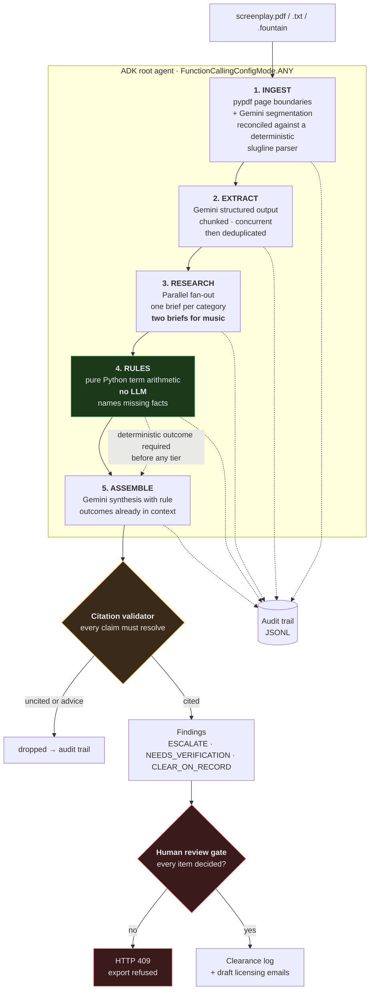

# ClearFrame

**Script clearance research and triage.** Reads a screenplay, finds every brand,
song, real person, location, published work and name collision in it, runs
sourced web research on each, applies deterministic copyright-term rules, and
produces a review-ready clearance log where every claim carries a citation.

> **ClearFrame does not give legal advice and never marks an item as cleared.**
> It surfaces evidence and organises reviewer workload for a qualified attorney,
> who makes every actual decision. This constraint is enforced in code — see
> [Positioning, enforced in code](#positioning-enforced-in-code).

Built for the Google Cloud *Agentic Cinema* hackathon (Parallel partner track).

**[Demo Video →](https://youtu.be/rFu6IBvZGfQ)**
---

## The problem

A clearance review takes **2–3 weeks** and costs **$5,000–15,000**. About **90%
of it is research, not judgment** — reading the script, listing what's
flaggable, then looking each item up. The judgment part, the part that genuinely
needs an attorney, is the last 10%.

Independent productions skip it, not because they think it's optional, but
because three weeks and $10k is the whole post budget. ClearFrame automates the
90% so the 10% is affordable.

---

## Architecture



### The five stages

| # | Stage | What it does | Why it's built this way |
|---|:---|:---|:---|
| 1 | **Ingest** | PDF → scenes with real page numbers | Counsel reads a finding and goes to find the line. The deterministic slugline parser is the **authority** on which physical page a heading sits on and overrides the model on every disagreement. Text and PDF of the same script yield byte-identical page attribution. |
| 2 | **Extract** | Scenes → deduplicated items | One item = one paid research fan-out, so dedup is the cost control. On the sample, 32 mentions collapse to 23 items. |
| 3 | **Research** | Parallel fan-out, category-specific briefs | A generic query wastes Parallel's depth. Music always gets **two** briefs — composition and sound recording are separate rights. |
| 4 | **Rules** | Facts → copyright/publicity terms | Pure Python. If a required fact is missing it returns `INSUFFICIENT_FACTS` **naming the field**, rather than guessing a year. |
| 5 | **Assemble** | Evidence + rules → tiered, cited findings | The model receives rule outcomes as ground truth and cannot lower a compelled tier. |

---

## Positioning, enforced in code

Not copy — tests:

| Guarantee | Where | Test |
|:---|:---|:---|
| No `CLEARED` state exists anywhere | `models.py` | `test_no_schema_exposes_a_cleared_state` walks every enum |
| The rules engine never calls an LLM | `tools/rules_engine.py` | `test_rules_engine_module_makes_no_model_calls` parses the AST |
| No agent wrapper libraries (ADK only) | whole package | `test_no_agent_wrapper_library_is_imported_anywhere` walks every file's AST |
| Uncited claims are deleted | `validation/citations.py` | `test_uncited_claim_is_removed` |
| Advice language deleted **even when cited** | `validation/citations.py` | `test_advice_language_is_removed_even_when_cited` |
| Export blocked until every item reviewed | `api/main.py` | `test_export_returns_409_while_any_item_is_pending` |
| Zero items from a parsed script is a failure | `agents/orchestrator.py` | `test_zero_items_from_a_parsed_script_is_a_failure_not_a_clean_report` |

`CLEAR_ON_RECORD` means *"no clearance action likely needed, pending reviewer
sign-off."* It is never rendered as "Cleared", "Safe" or "OK".

---

## Where Google Cloud and Parallel are called at runtime

Exact locations, for verification:

### Google Cloud — Gemini

| What | File | Line |
|:---|:---|---:|
| **Every async Gemini call** (retry + timeout wrapper) | [`src/clearframe/tools/gemini_client.py`](src/clearframe/tools/gemini_client.py) | **177** — `client.aio.models.generate_content(...)` |
| Client construction, both auth paths | [`src/clearframe/tools/gemini_client.py`](src/clearframe/tools/gemini_client.py) | 50–76 — `genai.Client(...)` |
| Scene segmentation (sync call) | [`src/clearframe/ingest/parser.py`](src/clearframe/ingest/parser.py) | **410** — `client.models.generate_content(...)` |
| Item extraction | [`src/clearframe/agents/extractor.py`](src/clearframe/agents/extractor.py) | **390** — `generate_with_retry(...)` |
| Fact extraction from evidence | [`src/clearframe/agents/assembler.py`](src/clearframe/agents/assembler.py) | **340** — `generate_with_retry(...)` |
| Finding synthesis | [`src/clearframe/agents/assembler.py`](src/clearframe/agents/assembler.py) | **616** — `generate_with_retry(...)` |
| Explicit safety settings | [`src/clearframe/config.py`](src/clearframe/config.py) | **328** — `build_safety_settings()` |

### Google Cloud — Agent Development Kit

| What | File | Line |
|:---|:---|---:|
| Root agent | [`src/clearframe/agents/orchestrator.py`](src/clearframe/agents/orchestrator.py) | **400** — `LlmAgent(...)` |
| **Forced function calling** | [`src/clearframe/agents/orchestrator.py`](src/clearframe/agents/orchestrator.py) | **412–415** — `FunctionCallingConfigMode.ANY` |
| Six pipeline stages as ADK tools | [`src/clearframe/agents/orchestrator.py`](src/clearframe/agents/orchestrator.py) | **373–378** — `FunctionTool(...)` |
| Agent runner | [`src/clearframe/agents/orchestrator.py`](src/clearframe/agents/orchestrator.py) | **538** — `Runner(...)` |

ADK is used **natively**. No LangChain, LangGraph or other wrapper appears
anywhere, and an AST test enforces it.

### Parallel — partner integration

| What | File | Line |
|:---|:---|---:|
| Async client construction | [`src/clearframe/tools/parallel_client.py`](src/clearframe/tools/parallel_client.py) | **202** — `parallel.AsyncParallel(...)` |
| **Search API call** | [`src/clearframe/tools/parallel_client.py`](src/clearframe/tools/parallel_client.py) | **346** — `self._client.search(...)` |
| Task API call (typed deep research) | [`src/clearframe/tools/parallel_client.py`](src/clearframe/tools/parallel_client.py) | **374** — `self._client.task_run.execute(...)` |
| Category briefs + fan-out | [`src/clearframe/agents/researcher.py`](src/clearframe/agents/researcher.py) | **445–446** — `asyncio.gather(client.search(...))` |

Every Parallel result becomes an `Evidence` object with a real URL and retrieval
timestamp. Sources without a URL are discarded at ingest.

---

## Setup from a clean clone

```bash
git clone <repo> && cd ClearFrame

python3.12 -m venv .venv && source .venv/bin/activate
pip install -r requirements.txt

cp .env.example .env
# Fill in GOOGLE_API_KEY (or GEMINI_API_KEY) and PARALLEL_API_KEY

pytest                                   # 318 tests, no API keys needed
```

### Run the API

**This is the only supported invocation.** The Dockerfile uses the same form.

```bash
PYTHONPATH=src uvicorn clearframe.api.main:app --port 8080 --reload
```

> Do not run it as `uvicorn src.clearframe.api.main:app`. That puts `src` on the
> path as a package root, so Python ends up holding two distinct copies of every
> `clearframe` module — `clearframe.config` and `src.clearframe.config`. Because
> `get_settings()` is LRU-cached, each copy carries its own settings and its own
> in-memory report store, so a report created through one is invisible to the
> other. A `sys.path` shim to make that form work was removed for this reason;
> please fix the command rather than re-adding the shim.

- API docs: <http://localhost:8080/docs>
- Reference UI: <http://localhost:8080/ui>
- Health: <http://localhost:8080/api/health>
- Frontend contract: [`docs/api-contract.md`](docs/api-contract.md)

### Run the pipeline directly

```bash
PYTHONPATH=src python -c "
import asyncio
from pathlib import Path
from clearframe.agents.orchestrator import run_pipeline
r = asyncio.run(run_pipeline(Path('data/scripts/the_last_good_year.pdf')))
print(r.tier_counts())
"
```

### Run the benchmark

```bash
python scripts/run_benchmark.py            # score the stored report
python scripts/run_benchmark.py --run      # run the pipeline first, then score
python scripts/run_benchmark.py --json     # machine-readable
```

---

## Benchmark

19 items scored against [`data/golden_set.json`](data/golden_set.json), each
verified by **independent** fresh web research. The pipeline's own stored
Parallel evidence was deliberately not re-read, so a source it never retrieved
can contradict it — and two did.

| Metric | Result | |
|:---|---:|:---|
| Extraction recall | **100.0%** | 18/18 golden items extracted |
| Extraction precision | **94.7%** | 1 known false positive |
| Evidence coverage | **100.0%** | 18/18 items with ≥1 sourced citation |
| Evidence-citation accuracy | **100.0%** | 18/18 findings where every claim resolves |
| Rules-engine accuracy | **100.0%** | 3/3 term calculations match verified year |

**16 MATCH · 1 PARTIAL · 2 MISMATCH**, all 19 entries scored. The failures are documented in the golden set
with sources; see [`docs/devpost-writeup.md`](docs/devpost-writeup.md).

The golden set was verified via independent AI-assisted web research, not full
manual paralegal review. Every source URL is recorded so any entry can be
re-checked by hand.

---

## The flagship result

*"Bye Bye Blackbird"*, one song, **two rights, opposite answers**:

| Right | Rule | Outcome | PD from |
|:---|:---|:---|---:|
| Musical composition | `US_PUB_PRE_1978_95_YEARS` (17 U.S.C. § 304(b)) | `PUBLIC_DOMAIN` | **2022** |
| Sound recording | `US_SOUND_RECORDING_MMA` (17 U.S.C. § 1401) | `IN_COPYRIGHT` | **2027** |

Both established from the same sourced 1926 date, across 16 sources tagged by
right. Conflating these is the most common clearance error in music; ClearFrame
issues two separate research briefs so it cannot happen.

---

## Gemini safety configuration

Set explicitly in [`config.py`](src/clearframe/config.py), not inherited:

| Category | Threshold |
|:---|:---|
| `HARM_CATEGORY_HARASSMENT` | `BLOCK_ONLY_HIGH` |
| `HARM_CATEGORY_HATE_SPEECH` | `BLOCK_ONLY_HIGH` |
| `HARM_CATEGORY_SEXUALLY_EXPLICIT` | `BLOCK_ONLY_HIGH` |
| `HARM_CATEGORY_DANGEROUS_CONTENT` | `BLOCK_ONLY_HIGH` |

Screenplays contain violence, profanity and adult themes as ordinary dramatic
subject matter. At default thresholds Gemini silently returns no candidate for
such chunks — and **a silently skipped scene is a missed clearance item**, which
is a correctness failure for this product. Any chunk still blocked at this
threshold is written to the audit trail as a `SAFETY_BLOCKED` entry naming the
affected scene range, so the gap is visible rather than invisible.

---

## Environment variables

| Variable | Default | Notes |
|:---|:---|:---|
| `GOOGLE_API_KEY` | — | Gemini API key. `GEMINI_API_KEY` is accepted as an alias. |
| `GOOGLE_GENAI_USE_VERTEXAI` | `false` | `true` routes via Vertex AI and **ignores the API key**, using ADC. |
| `GOOGLE_CLOUD_PROJECT` | — | Required when `GOOGLE_GENAI_USE_VERTEXAI=true`. |
| `GOOGLE_CLOUD_LOCATION` | `us-central1` | Vertex region. |
| `GEMINI_PARSE_MODEL` | `gemini-flash-latest` | Scene segmentation. |
| `GEMINI_EXTRACTION_MODEL` | `gemini-3.1-pro-preview` | Item extraction. Pro deliberately — see below. |
| `GEMINI_SYNTHESIS_MODEL` | `gemini-3.1-pro-preview` | Fact extraction and finding synthesis. |
| `GEMINI_ORCHESTRATOR_MODEL` | `gemini-3.1-pro-preview` | ADK root agent. |
| `GEMINI_SAFETY_THRESHOLD` | `BLOCK_ONLY_HIGH` | Applied to all four categories. |
| `GEMINI_TIMEOUT_SECONDS` | `180` | Per-call timeout. |
| `GEMINI_MAX_RETRIES` | `3` | Backoff with full jitter; billing caps are **not** retried. |
| `GEMINI_MAX_CONCURRENCY` | `6` | Cap on simultaneous Gemini calls. |
| `PARALLEL_API_KEY` | — | Partner integration. |
| `PARALLEL_PROCESSOR` | `base` | Task API tier. |
| `PARALLEL_TIMEOUT_SECONDS` | `300` | Per-call timeout. |
| `PARALLEL_MAX_RETRIES` | `4` | Retries on 429/5xx only. |
| `PARALLEL_MAX_CONCURRENCY` | `6` | Hard cap on simultaneous research tasks. |
| `USE_SECRET_MANAGER` | `false` | Resolve secrets from Secret Manager before env vars. |
| `PARALLEL_API_KEY_SECRET` | `clearframe-parallel-api-key` | Secret Manager secret id. |
| `SCENES_PER_EXTRACTION_CHUNK` | `9` | Scenes per extraction call. |
| `PORT` | `8080` | Cloud Run injects this. |
| `LOG_LEVEL` | `INFO` | |

**On the model split:** Flash is used for scene segmentation, where it matched
Pro exactly across every measured run and the deterministic parser backstops it.
Extraction stays on Pro because on Flash, item recall and `depiction_nature`
varied run to run at `temperature=0` — and a dropped item is never recovered by
a later stage, whereas a wrong tier is at least surfaced to a human.

---

## Deployment

### Cloud Run (primary)

```bash
gcloud secrets create clearframe-parallel-api-key --replication-policy=automatic
echo -n "$PARALLEL_API_KEY" | gcloud secrets versions add clearframe-parallel-api-key --data-file=-

gcloud run deploy clearframe \
  --source . \
  --region us-central1 \
  --allow-unauthenticated \
  --memory 2Gi --cpu 2 --timeout 3600 \
  --set-env-vars "USE_SECRET_MANAGER=true,GOOGLE_GENAI_USE_VERTEXAI=true,GOOGLE_CLOUD_PROJECT=$PROJECT" \
  --set-secrets "PARALLEL_API_KEY=clearframe-parallel-api-key:latest"
```

The container is multi-stage, runs as non-root uid 1001, listens on `$PORT`, and
has a `HEALTHCHECK` against `/api/health`.

Secrets resolve from Secret Manager first when `USE_SECRET_MANAGER=true`, with
env-var fallback for local development
([`config.py`](src/clearframe/config.py), `resolve_parallel_api_key`).

### Vertex AI Agent Engine (optional, after Cloud Run)

The ADK root agent in `agents/orchestrator.py` (`build_root_agent`) is
deployable to Agent Engine independently of the API.

---

## Repository layout

```
clearframe/
├── data/
│   ├── copyright_rules.yaml      # 10 rules, US + India, each with a statutory citation
│   ├── golden_set.json           # 19 independently verified benchmark entries
│   └── scripts/                  # sample screenplay (.txt and .pdf)
├── docs/
│   ├── api-contract.md           # frontend integration contract
│   └── devpost-writeup.md
├── frontend/index.html           # zero-dependency reference UI, served at /ui
├── scripts/run_benchmark.py
├── src/clearframe/
│   ├── config.py                 # env + Secret Manager, explicit safety settings
│   ├── models.py                 # all Pydantic schemas
│   ├── ingest/parser.py          # PDF/text → Scene, page numbers anchored
│   ├── agents/
│   │   ├── extractor.py          # Gemini structured extraction + dedup
│   │   ├── researcher.py         # Parallel fan-out, category briefs
│   │   ├── assembler.py          # evidence + rules → tiered findings
│   │   └── orchestrator.py       # ADK root agent
│   ├── tools/
│   │   ├── gemini_client.py      # shared client, retry + timeout
│   │   ├── parallel_client.py    # Parallel wrapper, retries, bounded concurrency
│   │   └── rules_engine.py       # DETERMINISTIC term logic, no LLM
│   ├── validation/citations.py   # drops uncited and advice-bearing claims
│   ├── audit/logger.py           # structured JSONL trail
│   ├── export/report.py          # markdown log + draft licensing emails
│   └── api/main.py               # FastAPI, 409 review gate
└── tests/                        # 318 tests
```

## Known limits

- **No authentication.** Add it before exposing a deployment publicly.
- **In-memory report storage.** Reports are lost on restart and are not shared
  across Cloud Run instances. Swapping in Firestore is a store-interface change.
- **No pagination.** A feature-length script returns a multi-MB report payload.
- US and India copyright terms only. US publicity terms require domicile.
- Extraction is not bit-reproducible run to run; entity grouping varies at the
  margins, though occurrence counts have been stable across runs.

## Licence

MIT — see [LICENSE](LICENSE).
